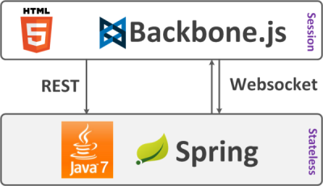
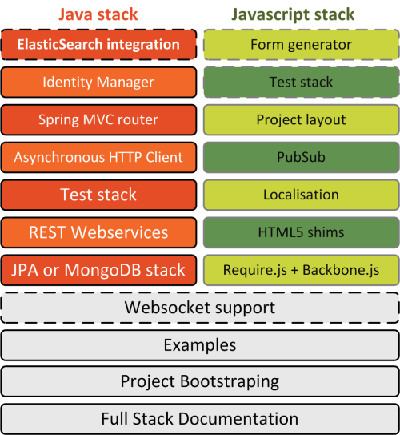

.. title:: RESThub

.. image:: _static/spring+backbone.png
	:align: center

Presentation
============

**RESThub** is a stack based on **Spring** and **Backbone.js** designed to allow you to build **HTML5** applications easily and efficiently.
It provides some toolings, libraries and documentation in order to build modular web applications with **client side state**, **stateless server** and REST webservices or Websocket communication between both.

RESThub is a stack, not a framework. It has been created to get in one place tooling, documentation, best practices and libraries needed to build your HTML5 web application. It is composed by the following modules :

Table of contents
=================

.. toctree::
    :maxdepth: 2

    getting-started
    spring-stack
    backbone-stack
    training/spring
    training/backbone
	
